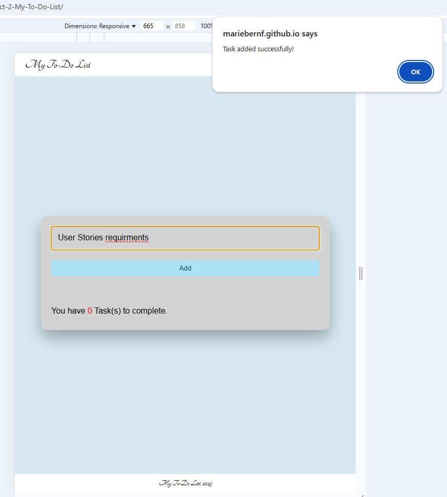
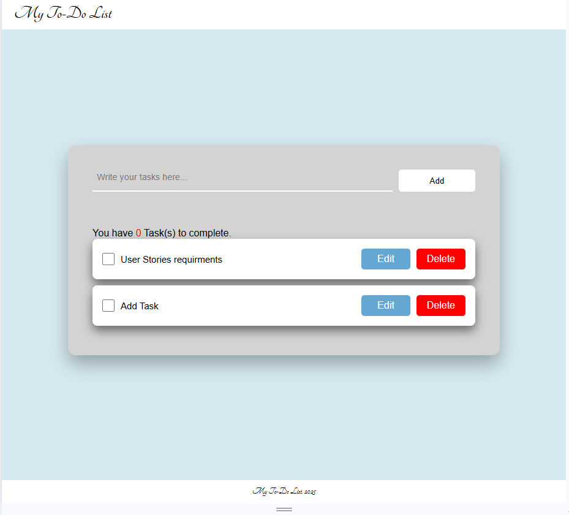
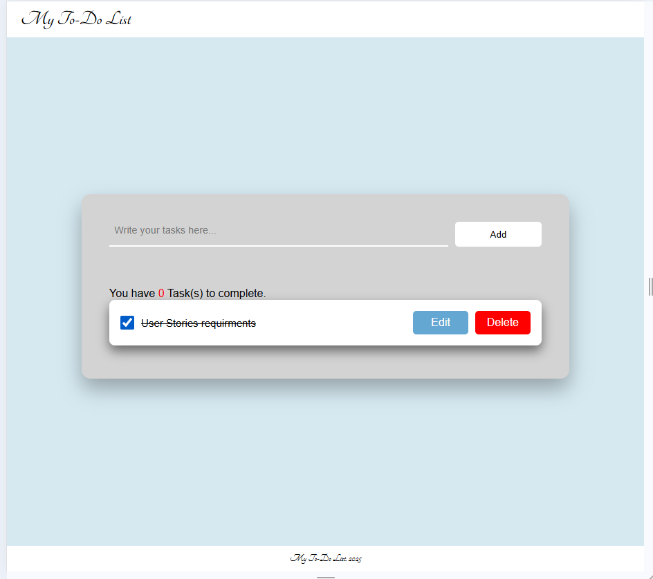
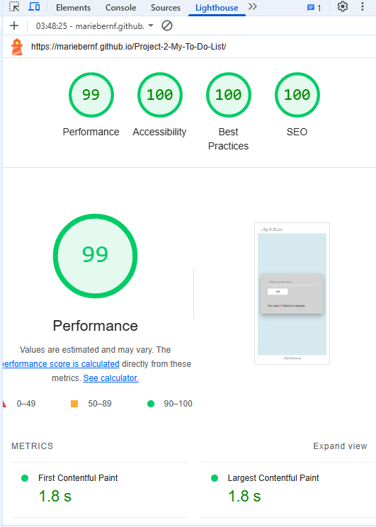

# Project-2-My-To-Do-List

 **The website is a To-do application which helps users manage their tasks. Tasks are displayed clearly. Users can edit their tasks by clicking the edit button. They can delete them by clicking the delete button. Tasks can be marked as complete. If a user tries to add an empty task, an error alert will appear.**

**View here** https://mariebernf.github.io/Project-2-My-To-Do-List/

# User stories

## User story 1:
* I want to be able to navigate the site easily and have a user friendly experience. 
* I want to manage my to-do list without difficulty.
* I want to use a clear website with easy to understand instructions.

## User story 2: 
* I want to be able to add a new task.
* I want to edit tasks.
* I want to delete tasks.
* I want to mark tasks has done.

## Screen shots fo active site that meet users requirments:

* Simple navigation and user-friendly website. Add tasks easily.
  

* Edit and delete tasks.
  

* The user can mark tasks as done.

# Design

## Colour Scheme
**Background colour:** Light blue: This gives the site a calm appearance, making a welcoming atmosphere.

**Text colour:** Black: The main text throughout the site is in black, which provides high contrast against the light blue background. This ensures readability and clarity.

**Buttons:** 
* Add button: Has a white background with black text, this makes it look clean and easy to use.
 
* Delete button: Is red, symbolises urgency making it easy for users to identify. It draws attentions to the user.
  
* Edit button: Is light blue which aligns with the sites colour scheme.

**Error message:** Red: Indicates a warning, catching the user's attention to alert them about an empty task input.

**Task status:** Text colour black with a line through. 

**Header and footer:** White: Creates a simple and clean contrast with the light blue background.

**The combination of light blue, white and black gives the site a calm, modern and clean look. The use of red for error and delete buttons draws attention to alert the user. This combination makes the interface user-friendly.**

## Typography
 * I have chosen to use Arial for the general text because it is easy to read, simple and modern.
 * I chose Tangerine for the header and footer to give it a more refined and elegant look.
 * The combination of Arial for the main content and Tangerine for the header and footer works well becasue it balances readablity with a refined look.

# Features

**The To-Do List application provides users with a simple and interactive way to manage their tasks.**

**The key functions are:**

**1. Add new Task**

* Users can type a task into the input field and click the "Add task" button to add a new task to the list.
* If the input field is empty, an error message is shown that the user needs to enter a task.
* After adding a task, the task count is updated and the input field is cleared.

**2. Edit Task**
* Each task has an "Edit" button next to it, allowing users to modify the task.
* When edited the task is removed from the list, and the updated task is added.

**3. Delete Task**
* Each task has a "Delete" button next to it, that removes the task from the list.

**4. Task completed checkbox**
* Each task has a checkbox that users can check to mark the task as completed.

**5. Pop-up message**
* After adding a task, a success message "Task added successfully!" is displayed in a pop-up to inform the users that their task has been added.

**Future improvments:**

**1. Categorize tasks:**
* Allow users to categorize tasks e.g Work, study, personal, shopping.

**2. Display date of task:**
* Show the date the task was created.
* Let users have the option of setting a due date for the task to be completed.

**3. Prioritize tasks:**
* Allow users to mark their tasks as high, medium or low priority.

**4. Save the task list:**
* Enable users to save their task list.

# Technologies used

**1. HTML:** Used to structure the content of the website.

**2. CSS:** Used for styling the website.

**3. JavaScript:** Used to add interactivity and functionality to the website.
   
# Deployment
## Deployment steps:
1. Go to the settings tab in your Github repository. 
2. Select pages in the code and automation section.
3. Ensure the source is set to "Deploy from branch".
4. This can take a few minutes.
5. Gitpages will now show Active deployments.

# Testing

**Manual testing:**

**Responsiveness:** The website is responsive on different devices and browsers: Google Chrome, Safari and Microsoft Edge.

**Buttons:** 
* Add button: Verified that the add button adds a new task when clicked.
* Delete button: Verified that the delete button deletes content when clicked.
* Edit button: Verified that the edit button works.

**Error message for an empty input:** Verified that the error message is displayed when the input field is left empty.

**Task status and checkbox:** Verified that when the task is checked off using the checkbox, it will display a line through the text.

**Pop-up Alert:** Verified the "Task added successfully!" pop-up message appears when a task is successfully added. 

***

**HTML Tested by W3C validator:**

**CSS Tested by W3C (Jigsaw) validator:**

***

**JSLint**

**After running the JavaScript code through JSLint, several changes were made:**

* JSLint recommended using regular functions instead of arrow functions to ensure compatibility. I changed the arrow function with function declarations.

* JSLint warned about undeclared global variables. I added a comment at the beginning of the JavaScript file to declare console and alert as global variables.

* JSLint warned about enexpected trailing spaces in my code. I removed trailing spaces from lines.

* JSLint recommended using double quotes instead of single quotes. I changed strings to double quotes.

* JSLint found missing semicolons. I added the missing semicolons to the end of the statements where necessary.

**Unresolved issues in JSLint:**

* Undeclared console and undeclared alert: I added the comment at the beginning of the JavaScript to declare console and alert as global variables, but it still returned a warning. After researching these warnings the advice I found was that if they do not affect the functionality of the website they are safe to ignore. I have noted these warnings but left them unresolved because the code continues to function properly.

***

**Lighthouse**

***

# Bugs and Fixes

**Edit and delete buttons were not responsive.**

**Issue:** The edit and delete buttons were not adjusting properly to different screen sizes.

**Resolved:** *Placed the buttons inside a flexbox container, making them adjust to different screen sizes.*

***

**Text overflow in the task list.**

**Issue:** Text was overflowing and not wrapping inside the container.

**Resolved:** *Enabled word wrap to ensure the text fits inside the task container.*

# Credits

This website was inspired by a youtube tutorial called "To Do List App With Javascript" by the coding Artist. I made modifications to the original code but it does use some code directly from the tutorial: 

**The tutorial can be found here:** [To Do List App With Javascript](https://www.youtube.com/watch?v=c48pBHlnsPE&t=712s)

**Direct code from the tutorial:** [Credits](docs/credits.md)

**Fav icon:**
[Fav icon](https://favicon.io)

**Google Fonts (Tangerine):**
[Google Fonts - Tangerine](https://fonts.google.com)

